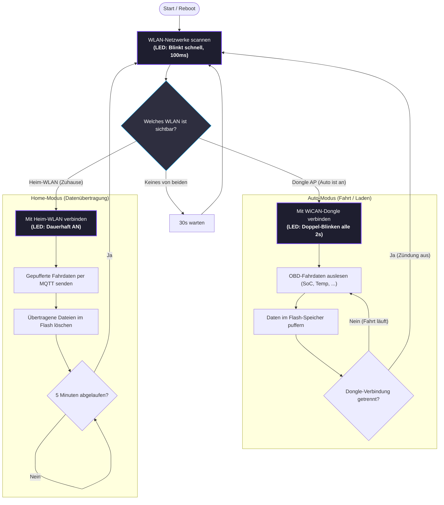
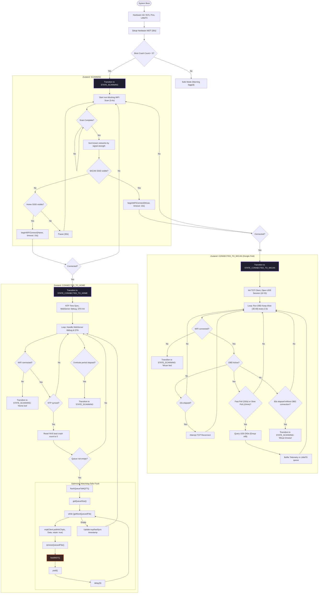
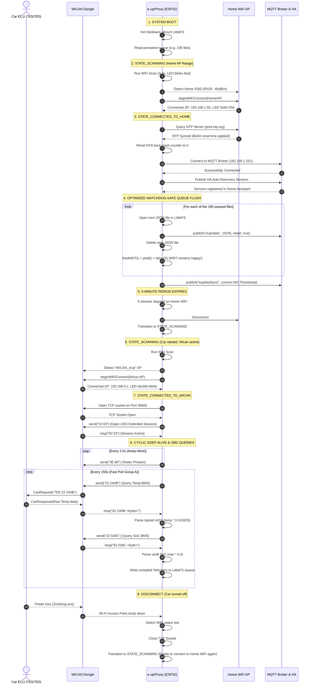

# e-up!Proxy System Architecture & Diagram Guide
> **Firmware Version Alignment:** `2.4.2-dongle-first`  
> **Last updated:** 2026-05-31

This document provides a graphical breakdown of the entire functional loop, states, timings, and dynamic sequences of the `e-up!Proxy`.

---

## 0. High-Level Funktionsübersicht (Vereinfacht)

Dieses vereinfachte Flussdiagramm zeigt ausschließlich die drei Hauptfunktionen des Proxys: Netzwerksuche, automatischer Verbindungswechsel und Datenübertragung (Flush) an Home Assistant.

---

## 1. System States & Control Flow Diagram (Detailliert)

The following flowchart details the non-blocking state machine, network scanning decision tree, watchdog feeding loops, and the new **"Dongle First" exklusiv** architecture.

---

## 2. Dynamic Sequence Diagram

This diagram maps out the live, physical interactions between the ESP32 Proxy, the WiCAN Dongle/Car ECU, and the Home WiFi AP / MQTT Broker / Home Assistant during a full cycle of operation.

