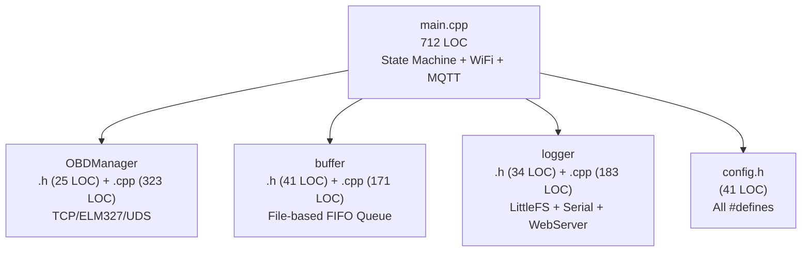

# Projekt-Retrospektive: e-up!Proxy v2.1
**Datum:** 2026-05-26  
**Firmware:** `2.1-ota-logfix`  
**Projektpfad:** `/home/bert/projects/e-up!Proxy/`  
**Scope:** Vollständige Codebase-Analyse (1.575 LOC Produktion, 0 LOC Tests)

---

## Scorecard (Gesamtübersicht)

| Kategorie | Note | Kommentar |
|---|:---:|---|
| Architektur & Modulstruktur | **B+** | Saubere 4-Modul-Trennung, klare Header/CPP-Separierung |
| Codequalität & Wartbarkeit | **B−** | Solide Basics, aber `main.cpp` ist zu groß und hat Redundanzen |
| Sicherheit & Secrets-Management | **B−** | `config.example.h` vorhanden, config.h gitignored, aber SPEC.md leakt |
| Testabdeckung | **F** | Null Tests, kein Test-Framework konfiguriert |
| Fehlerbehandlung & Resilienz | **B** | Gutes WDT-Setup, OBD-Reconnect, aber blockierender WiFi-Connect |
| Speicher & Performance | **B** | File-basierter FIFO, aber `initBuffer()` wird exzessiv aufgerufen |
| OBD-Protokollschicht | **A−** | Elegantes generisches UDS-Query-System, Group A/B Split |
| Dokumentation & Betriebsreife | **A−** | Exzellente SPEC.md, MISSIONPROMPT.md, config.example.h |
| **Gesamt** | **B−** | |

---

## 1. Architektur & Modulstruktur — Note: B+

### Was gut ist

Die Codebase folgt einer klaren **4-Modul-Architektur** mit sauberer Header/Implementation-Trennung:



- **Saubere `.h` / `.cpp` Trennung:** Alle Module haben schlanke Header mit reinen Deklarationen und separate Implementation-Dateien. Das ermöglicht schnelle Inkremental-Builds.
- **OBDManager als freistehende Funktionen** statt Klasse: `connectOBD()`, `queryGroupA()`, `queryGroupB()` — pragmatisch und richtig für Embedded.
- **TelemetryData** als zentrale Austausch-Struktur in `buffer.h` definiert und von allen Modulen referenziert.
- **State Machine** mit 3 klar definierten Zuständen (`STATE_SCANNING`, `STATE_CONNECTED_TO_WICAN`, `STATE_CONNECTED_TO_HOME`) und einer zentralen `transitionTo()`-Funktion.
- **SPEC.md** als formale Spezifikation sorgt dafür, dass Design-Entscheidungen dokumentiert und nachvollziehbar sind.

### Was verbessert werden sollte

> [!IMPORTANT]
> **`main.cpp` ist mit 712 LOC der Monolith**

`main.cpp` enthält aktuell:
- State Machine + `transitionTo()` (Zeilen 66–119)
- WDT Setup/Feed (Zeilen 122–140)
- LED-Steuerung (Zeilen 142–168)
- WiFi-Scan-Handler mit Bubble-Sort (Zeilen 170–320)
- OBD-Fetch-Wrapper + Sim-Fallback (Zeilen 322–370)
- WiCAN-Handler mit Reconnect-Scheduler (Zeilen 372–415)
- HA Auto-Discovery Publisher (Zeilen 418–510)
- MQTT Flush + lastSync (Zeilen 512–580)
- Home-Handler mit NTP-Sync (Zeilen 582–640)
- `setup()` + `loop()` (Zeilen 642–712)

Das sind mindestens **4 extrahierbare Module**: `WiFiScanner`, `MQTTPublisher`, `HADiscovery`, `LEDController`.

**Weitere Befunde:**
- 12 `static`-Variablen im File-Scope von `main.cpp` (Zeilen 33–52): Timer, Flags, Caches. Diese wären in einem `ProxyContext`-Struct besser aufgehoben — aktuell muss man alle 12 Variablen mental tracken.
- `handleScanning()` enthält einen manuellen **Bubble-Sort** für RSSI-Sortierung mit `new int[]` + `delete[]`. Das ist korrekt, aber für Scan-Ergebnisse (typisch < 20 APs) würde ein einfacher `std::sort` eleganter sein und weniger fehleranfällig (kein manuelles Memory-Management).

---

## 2. Codequalität & Wartbarkeit — Note: B−

### Was gut ist

- **Konsistentes Logging:** Alle Module nutzen `logEvent(level, message)` mit klaren Kategorien (`BOOT`, `SCAN`, `SWITCH`, `CONN`, `DATA`, `ERROR`, `MQTT`).
- **Englische Code-Konvention durchgehalten:** Variablen, Funktionen, Kommentare, Log-Messages — alles English. Konsistent umgesetzt, wie in MISSIONPROMPT.md gefordert.
- **`config.example.h` als Template:** Vorbildlich. Neue Entwickler wissen sofort, welche Werte sie eintragen müssen.
- **ArduinoJson v7** statt v6: Nutzt das moderne `JsonDocument` ohne feste Größenangabe — eliminiert das Overflow-Risiko komplett.
- **Generische UDS-Query-Funktionen:** `queryUDS1Byte()`, `queryUDS2Bytes()`, `queryUDS3Bytes()` sind elegant parametrisiert mit `(header, did, outVal, scale, offset)`. Neue DIDs hinzufügen = eine Zeile.

### Was verbessert werden sollte

> [!WARNING]
> **TelemetryData-Serialisierung erscheint 2× identisch**

Die JSON-Serialisierung von `TelemetryData` wird in **zwei Stellen** manuell Feld für Feld aufgebaut:
1. `enqueueData()` in `buffer.cpp` (Zeilen ~38–50)
2. `flushQueueToMQTT()` in `main.cpp` (Zeilen ~530–545)

Jedes neue Telemetrie-Feld muss an beiden Stellen synchron ergänzt werden. Eine `TelemetryData::toJson(JsonDocument&)` Hilfsfunktion würde das konsolidieren.

**Weitere Code-Smells:**

1. **`TelemetryData.src` ist ein `String`** statt `char[16]`:
   - In `buffer.h`: `String src;` — das ist ein dynamisch allokierter Arduino-String auf dem Heap.
   - Bei häufigem Enqueue/Dequeue fragmentiert das den ESP32-Heap.
   - Ein festes `char src[16]` wäre effizienter und vermeidet Heap-Fragmentierung.

2. **Blockierender WiFi-Connect in `handleScanning()`:**
   ```cpp
   while (WiFi.status() != WL_CONNECTED && millis() - startAttempt < 10000) {
       updateLED();
       feedWDT();
       delay(50);
   }
   ```
   Das blockiert die State Machine bis zu **10 Sekunden** (WiCAN) bzw. **15 Sekunden** (Home). Während dieser Zeit ist der Webserver nicht erreichbar. Der `feedWDT()`-Aufruf verhindert zwar den Watchdog-Reset, aber der ESP32 ist effektiv eingefroren.

3. **`initBuffer()` wird bei JEDEM Aufruf erneut ausgeführt:**
   `enqueueData()`, `getNextQueuedFile()`, `getQueueSize()` und `clearQueue()` rufen alle `initBuffer()` auf, welches `LittleFS.begin(true)` und Directory-Checks durchführt. Das ist redundant — ein einmaliger Init in `setup()` genügt, danach reicht ein `fsReady`-Flag.

4. **Magic Numbers:**
   - `300000` (5 min Home-Rescan), `600000` (10 min Slow-Poll), `60000` (1 min Fast-Poll), `2500` (Tester Present), `15000` (OBD Reconnect), `30000` (Scan-Retry-Pause) — alle als Inline-Literals.
   - Empfehlung: Benannte Konstanten in `config.h`.

5. **`handleScanning()` Scan-Retry-Pause ist blockierend:**
   ```cpp
   unsigned long pauseStart = millis();
   while (millis() - pauseStart < 30000) {
       updateLED();
       feedWDT();
       delay(50);
   }
   ```
   30 Sekunden blockierend warten, wenn kein Netzwerk gefunden wurde. Der Webserver ist in dieser Zeit unerreichbar (obwohl er ohnehin nicht gestartet ist in `STATE_SCANNING`).

---

## 3. Sicherheit & Secrets-Management — Note: B−

### Was gut ist

- **`config.h` ist gitignored** (`.gitignore` Zeile 4): Credentials werden nicht in Git eingecheckt.
- **`config.example.h` existiert** als Template mit Platzhaltern — vorbildlich für Onboarding.
- **MQTT-Client-ID ist MAC-basiert:** `"eupProxy_" + String(ESP.getEfuseMac(), HEX)` — verhindert Client-Kollisionen.
- **Nur ein Commit im Git-Repo** (`c807785`): Das Risiko, dass Credentials in der Git-History stecken, ist minimal.

### Was problematisch ist

> [!CAUTION]
> **SPEC.md leakt MQTT-Credentials**

`SPEC.md` (Zeile in SPEC-05) enthält:
```
Username: e-up!Proxy
Password: #4TheCar!
```
Und die vollständige User-Setup-Anleitung mit Passwort. **SPEC.md ist NICHT gitignored** und wurde mit dem Initial Commit eingecheckt.

> [!WARNING]
> **Kein OTA-Support**

Das Projekt hat aktuell:
- Keine ArduinoOTA-Integration
- Keine OTA-Partition-Table (nur ein einziges `[env:esp32dev]` ohne Partitions-Override)
- Kein `/upload`-Endpoint im Webserver

Jeder Firmware-Update erfordert physischen USB-Zugang. Für ein Auto-gebundenes Gerät ist das ein erheblicher Nachteil.

**Kein TLS:** MQTT auf Port 1883 (unverschlüsselt) — im Heimnetz-Kontext akzeptabel.

---

## 4. Testabdeckung — Note: F

> [!CAUTION]
> **Es existieren null Tests.**

- Kein `test/` Verzeichnis
- Kein `[env:native]` in `platformio.ini`
- Kein Unity/Catch2/GoogleTest Framework
- Keine Mock-Infrastruktur

Die gesamte Verifizierung findet ausschließlich durch manuelles Flashen und Log-Analyse statt.

### Kritisch untestete Logik

| Funktion | Risiko bei Fehler |
|---|---|
| `queryUDS1Byte/2Bytes/3Bytes()` — Hex-Parsing | Falsche SoC/Temperatur-Werte in HA |
| `deriveRange()` — Temperatur-Koeffizienten | Falsche Reichweite in HA |
| `enqueueData()` / `getNextQueuedFile()` Round-Trip | Datenverlust |
| `stripWhitespace()` | UDS-Response-Parsing bricht |
| WiFi-Scan-Priorisierung (WiCAN > Home) | Falsches Netzwerk gewählt |
| MQTT lastSync Timezone-Formatierung | HA zeigt falsche Zeit |

---

## 5. Fehlerbehandlung & Resilienz — Note: B

### Was gut ist

- **Hardware Watchdog:** 8 Sekunden Timeout, korrekt über `esp_task_wdt` konfiguriert, mit Versionsbranching für ESP-Arduino v2/v3 Kompatibilität.
- **OBD-Reconnect-Scheduler:** Alle 15 Sekunden wird bei verlorenem TCP-Socket ein erneuter Verbindungsversuch unternommen. Nach 60 Sekunden ohne Erfolg → Zurück zu `STATE_SCANNING`.
- **UDS Session Management:** `runOBDKeepAlive()` sendet `3E 80` (Tester Present, suppress positive response) alle 2.5s und sichert/restauriert den aktiven CAN-Header.
- **Korrupte Queue-Files werden automatisch gelöscht:** In `getNextQueuedFile()` wird bei JSON-Parse-Fehler die Datei entfernt, um Endlos-Schleifen zu verhindern.
- **Graceful OBD-Fallback:** Wenn `queryGroupA()` fehlschlägt, generiert `fetchOBDMetrics()` simulierte Telemetrie-Daten statt gar nichts zu senden. Das ist clever für die Entwicklungsphase.

### Was fehlt oder problematisch ist

> [!WARNING]
> **Watchdog-Timeout ist mit 8s extrem knapp**

Der WDT ist auf **8 Sekunden** gesetzt (`WDT_TIMEOUT_S = 8`). Aber:
- `handleScanning()` hat eine **30-Sekunden blockierende Pause** bei fehlenden Netzwerken
- WiFi-Connect blockiert **10–15 Sekunden**
- `sendCommand()` hat ein Timeout von **1.2 Sekunden** — 5 OBD-Queries in Folge = 6 Sekunden

Nur das kontinuierliche `feedWDT()` in den `while`-Schleifen verhindert den Watchdog-Reset. Wenn ein `feedWDT()` vergessen wird (z.B. in einer neuen blockierenden Funktion), löst der WDT aus und der ESP32 startet neu. Ein WDT von 30s wäre sicherer.

**Weitere Lücken:**

1. **Kein Boot-Loop-Schutz:** Kein NVS-basierter Boot-Counter. Bei einem systematischen Crash (z.B. NTP-DNS auf WiCAN) bootet der ESP32 endlos.

2. **NTP wird nur bei `STATE_CONNECTED_TO_HOME` konfiguriert:**
   ```cpp
   configTzTime(TZ_INFO, NTP_SERVER);
   ```
   Das ist korrekt und vermeidet den DNS-Crash im WiCAN-Netz. Aber: Wenn der ESP32 direkt ins WiCAN bootet (ohne vorherige Home-Verbindung), ist die Uhrzeit nie synchronisiert → `time(nullptr)` liefert Epoch 0 → Alle Timestamps sind falsch.

3. **`WiFi.disconnect(true)` in `transitionTo(STATE_SCANNING)`:** Der Parameter `true` löscht die gespeicherte WiFi-Konfiguration (WiFi.persistent). Das ist normalerweise gewünscht, aber in Edge-Cases kann es dazu führen, dass Auto-Reconnect nach einem kurzen Signalverlust nicht funktioniert.

---

## 6. Speicher & Performance — Note: B

### Flash-Layout

```
PlatformIO Default Partition (4 MB Flash):
├── nvs        16 KB     NVS Storage
├── otadata     8 KB     OTA Boot Selector  
├── app0       1.25 MB   Main Application (kein OTA-Slot!)
├── spiffs     1.5 MB    LittleFS (Logs + Queue)
└── (keine coredump-Partition)
```

> [!IMPORTANT]
> **Keine OTA-Partition!** Die Standard-Partition-Tabelle von PlatformIO hat nur einen App-Slot. Ein OTA-Update ist physisch unmöglich. Für OTA-Support müsste eine Custom-Partition-Table mit zwei App-Slots hinzugefügt werden.

### RAM-Nutzung

- **`TelemetryData` mit `String src`:** Jedes Struct allokiert dynamisch auf dem Heap. Bei `latestCachedData` als globaler Instanz ist das akzeptabel (nur eine Kopie), aber bei Queue-Operationen (`enqueueData` → Serialize → File) werden temporäre Kopien erzeugt.
- **ArduinoJson v7 `JsonDocument`:** Automatische Größenanpassung — kein Overflow-Risiko, aber auch kein festes Speicherbudget. Auf einem ESP32 mit begrenztem Heap (ca. 320 KB) ist das in Ordnung, solange nicht viele gleichzeitig existieren.

### File-basierter FIFO — Bewertung

Das Projekt nutzt einen **File-basierten FIFO** (`/queue/*.json`):

| Aspekt | Bewertung |
|---|---|
| Crash-Sicherheit | ✅ Überlebt Reboot — ideal für Offline-Pufferung |
| Geschwindigkeit | ⚠️ LittleFS I/O pro Eintrag — langsamer als RAM |
| Heap-Verbrauch | ✅ Minimal — kein RAM-Budget nötig |
| Wear Leveling | ⚠️ Flash-Writes pro Messung (alle 60s) |
| Kapazität | ✅ Begrenzt nur durch Flash (~1.5 MB verfügbar) |

**Befund:** Die File-FIFO ist für den Use-Case (offline-Pufferung über Stunden/Tage) die richtige Wahl. Aber: `initBuffer()` wird bei **jedem** Funktionsaufruf erneut durchlaufen — `LittleFS.begin(true)` und Directory-Check kosten jedes Mal I/O-Zyklen.

---

## 7. OBD-Protokollschicht — Note: A−

### Was hervorragend ist

Das **generische UDS-Query-System** in `OBDManager.cpp` ist das architektonische Highlight des Projekts:

```cpp
static bool queryUDS1Byte(const String& header, const String& did, 
                           float& outVal, float scale, float offset);
static bool queryUDS2Bytes(...);
static bool queryUDS3Bytes(...);
```

- **DRY-Prinzip:** Neue PIDs hinzufügen = eine Zeile in `queryGroupA()` oder `queryGroupB()`.
- **Scale/Offset-Pattern:** Die VW-Formeln (`raw × 0.4`, `raw − 40`, `raw × 0.1`) sind als Parameter codiert, nicht als Magic Numbers in jeder Query-Funktion.
- **Prefix-basiertes Parsing:** `"62" + stripWhitespace(did)` als erwarteter Response-Header — robust gegen Whitespace-Variationen.
- **Group A/B Split:** Schnelle Werte (SoC, Temp, Volt) alle 60s, langsame Werte (Odo, Service) alle 10min. Reduziert Busbelastung und Timeout-Risiko.
- **Simulationsmodus als Fallback:** Wenn OBD-Queries scheitern, werden simulierte Werte generiert. Das ermöglicht End-to-End-Tests der MQTT-Pipeline ohne Fahrzeug.

### Was verbessert werden sollte

1. **`sendCommand()` Timeout:** Standard ist **1.2 Sekunden**. Bei langsamen ECU-Antworten (Gateway `7E0` antwortet manchmal > 1s) könnte das zu verfrühten Timeouts führen. Das `AT ST FF` in der Init-Sequenz setzt den ELM327-internen Timeout auf Maximum, aber der TCP-Read-Timeout im Code liegt darunter. Empfehlung: Timeout auf mindestens 2 Sekunden erhöhen.

2. **`sendCommand()` liefert leere Strings bei Timeout:** Es fehlt ein dediziertes Timeout-Logging. Ein Timeout ist still — nur die `queryUDSxByte()`-Funktionen loggen den Fehler, aber ohne zu unterscheiden ob es ein Timeout oder ein NRC war.

3. **`stripWhitespace()` ist O(n) mit String-Konkatenation:** Jedes Zeichen wird einzeln an einen Arduino-String angehängt → O(n²) durch wiederholte Reallokation. Für typische OBD-Antworten (< 30 Zeichen) ist das akzeptabel, aber ein `reserve()` oder In-Place-Filter wäre effizienter.

4. **`connectOBD()` schließt die Verbindung bei Session-Fehler:** Wenn `10 03` (Extended Session) nicht mit `5003` antwortet, wird der TCP-Socket geschlossen und `false` zurückgegeben. Einige WiCAN-Firmware-Versionen antworten jedoch anders auf Session-Requests — hier fehlt Toleranz für alternative positive Responses.

5. **WiCAN-IP ist hardcodiert auf `192.168.4.1`:** In `config.h` steht `WICAN_IP "192.168.4.1"` (Standard-AP-Mode). Wenn der WiCAN im STA-Mode (z.B. ins Heimnetz eingebunden) betrieben wird, hat er eine andere IP. Das muss je nach Konfiguration validiert werden.

---

## 8. Dokumentation & Betriebsreife — Note: A−

### Was hervorragend ist

> [!TIP]
> **SPEC.md ist das stärkste Dokument im gesamten Projekt**

Die `SPEC.md` enthält:
- **SPEC-01:** State Machine mit LED-Patterns und Transition-Rules
- **SPEC-02:** Log-Format mit NTP-Timestamps und Boot-Sequenz
- **SPEC-03:** FIFO-Buffer-Schema mit JSON-Payload-Definition
- **SPEC-04:** Vollständige DID-Mapping-Tabelle mit ECU, Formel und Einheit
- **SPEC-05:** MQTT-Topic-Schema, Retained-Flags, HA-Discovery-Payloads, Timezone-Regeln
- **SPEC-06:** Changelog

Das ist **produktionsreife Spezifikation**. Jeder Entwickler kann die Firmware verstehen, ohne den Code zu lesen.

**MISSIONPROMPT.md** ist ebenfalls exzellent:
- Klare Flash-Prozedur mit Checkpoint
- Build-Commands mit `bash -l` Erklärung (warum Login-Shell nötig ist)
- Agent-Guardrails (max 3 Iterationen, Scope Lock, Clarification First)
- Artifacts-Konvention mit Dateinamen-Schema

### Was verbessert werden sollte

1. **Nur 1 Git-Commit:** Die gesamte Entwicklungshistorie ist verloren. Die aktuelle Arbeit (`M artifacts/implementation_plan.md`) ist nicht committet.

2. **`SPEC.md` und `MISSIONPROMPT.md` enthalten Credentials** (s. Sicherheits-Abschnitt).

3. **Kein README.md:** Im MISSIONPROMPT wird referenziert, dass README.md aktualisiert werden soll, aber die Datei existiert nicht.

4. **Kein CHANGELOG.md:** Ebenfalls im MISSIONPROMPT referenziert, aber nicht vorhanden.

5. **Firmware-Version in `config.h` vs. `config.example.h`:** Beide zeigen `2.1-ota-logfix` — die Version müsste bei jeder Änderung in BEIDEN Dateien aktualisiert werden. Besser: `FW_VERSION` in eine eigene `version.h` auslagern, die nicht gitignored ist.

---

## 10. Priorisierte Maßnahmen

### Priorität 1 — Showstopper

| # | Maßnahme | Aufwand | Auswirkung |
|---|---|---|---|
| **P1.1** | **WiCAN-IP validieren:** `config.h` hat `192.168.4.1`, aber Live-Tests zeigen `192.168.0.10`. Falsche IP = keine OBD-Verbindung möglich. | 5min | Kritisch |
| **P1.2** | **OTA-Support:** Custom Partition Table mit Dual-OTA-Slots + ArduinoOTA-Integration. Ohne OTA ist jedes Update ein USB-Gang zum Auto. | 2h | Kritisch |
| **P1.3** | **WDT-Timeout erhöhen:** Von 8s auf mindestens 30s. Die blockierenden WiFi-Connects (10–15s) und die 30s Scan-Pause überschreiten das Budget. | 5min | Hoch |
| **P1.4** | **Credentials aus SPEC.md entfernen.** MQTT-Passwort und HA-User-Setup referenzieren statt inlinen. | 10min | Hoch |

### Priorität 2 — Wartbarkeit

| # | Maßnahme | Aufwand |
|---|---|---|
| **P2.1** | `main.cpp` aufbrechen: WiFi-Scan, MQTT-Publisher, HA-Discovery als eigene Module | 2h |
| **P2.2** | `TelemetryData.src`: `String` → `char[16]` (Heap-Fragmentierung vermeiden) | 15min |
| **P2.3** | `initBuffer()` nur einmal in `setup()` aufrufen, danach `fsReady`-Flag verwenden | 15min |
| **P2.4** | Magic Numbers → benannte Konstanten in `config.h` | 15min |
| **P2.5** | `FW_VERSION` in eigene `version.h` auslagern (nicht gitignored) | 10min |
| **P2.6** | Git-Commit mit aktuellem Stand anlegen | 5min |

### Priorität 3 — Qualität & Robustheit

| # | Maßnahme | Aufwand |
|---|---|---|
| **P3.1** | Test-Framework einrichten: `[env:native]` + Unity + Mocks | 1h |
| **P3.2** | Unit-Tests für `queryUDS*Byte()`, `stripWhitespace()`, `deriveRange()` | 2h |
| **P3.3** | WiFi-Connect non-blocking umbauen (async State Machine statt blockierender `while`-Schleife) | 1h |
| **P3.4** | Boot-Loop-Breaker (NVS-Counter) | 1h |
| **P3.5** | `sendCommand()` Timeout-Logging hinzufügen | 15min |
| **P3.6** | README.md und CHANGELOG.md anlegen | 30min |
