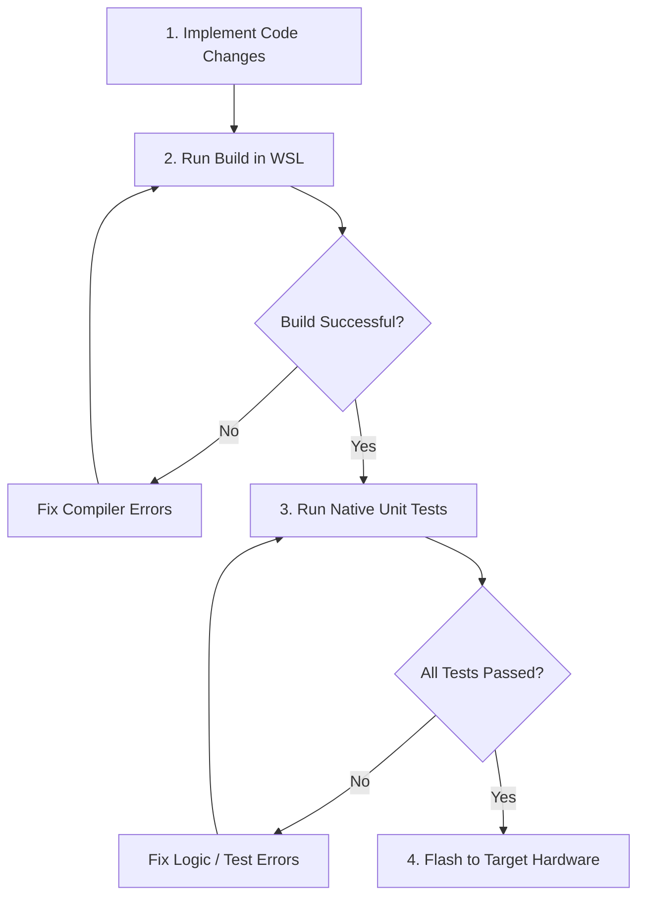

# WSL & Windows Multi-Platform Build & Flash Guide

This document is the absolute source of truth for building, testing, and flashing the `e-up!Proxy` firmware in our specific hybrid WSL2 (Ubuntu) and Windows 11 development environment. 

---

## 1. Environment & Architecture Overview

Our development environment consists of:
* **Host OS:** Windows 11 (Physical network interface, USB-to-Serial COM port).
* **Toolchain OS:** WSL2 (Ubuntu-22.04) (Natively runs gcc, tests, and standard PlatformIO builds).
* **Network:** WSL2 is configured in **Bridged Mode** (enabling direct IP communication in the `192.168.1.x` subnet).
* **Hardware Connection:** CH9102 USB-to-Serial adapter forwarded from Windows to WSL2 via `usbipd`.

---

## 2. Compilation Rules (WSL Native vs. Windows 9P Share)

> [!WARNING]
> **NEVER run PlatformIO (`pio`) from the Windows host on files residing inside the WSL filesystem (`\\wsl.localhost\Ubuntu-22.04\...`).**
> 
> * **The Issue:** Windows compilers trying to compile over the 9P virtual network protocol will read and write thousands of tiny header and source files, causing extreme compilation times (several minutes/hours) or freezing the terminal.
> * **The Rule:** Always compile **inside the WSL2 shell** using WSL-native PlatformIO.

---

## 3. PlatformIO Commands in WSL2

WSL PlatformIO is installed under the user's local path. Because non-interactive WSL shells do not load shell profile files (`.profile`, `.bashrc`), `pio` is not present in the default `$PATH`.

### Absolute Tool Path
The absolute path to `pio` in our WSL2 instance is:
`/home/bert/.local/bin/pio`

### The Login Shell Rule
When executing PlatformIO commands from an external shell or agent, always wrap them in a **login shell** (`bash -l`) so the environment variables are loaded correctly, or call the absolute path directly.

**Example Command (WSL):**
```bash
wsl -d Ubuntu-22.04 --cd /home/bert/projects/e-up!Proxy bash -l -c "pio run"
```

---

## 4. Step-by-Step Workflow for a Successful Build & Test

Always follow this exact sequence prior to flashing:



### Step 1: Compile the Firmware (WSL Target: esp32dev)
Compile only the active hardware environment inside WSL to avoid compile clutter:
```bash
wsl bash -c "cd /home/bert/projects/e-up\!Proxy && /home/bert/.local/bin/pio run -e esp32dev"
```

### Step 2: Run the Unit Tests (WSL Target: native)
Run the native Unity test suite on the host compiler inside WSL:
```bash
wsl bash -c "cd /home/bert/projects/e-up\!Proxy && /home/bert/.local/bin/pio test -e native"
```
*Note: Never run `pio run -e native` as the native environment does not define `main()` (it is reserved for the Unity test framework).*

---

## 5. Flashing Methods

> [!IMPORTANT]
> **Priority Rule:** If the e-up!Proxy is physically connected or available via USB, **USB Serial Flashing (Method B) ALWAYS takes precedence and priority over OTA Flashing (Method A).** OTA should only be used when the device is deployed remotely and USB is unavailable.

### Method A: Direct OTA Upload (Windows Native - Zero-Surprise Standard)

To bypass WSL2 virtual NAT, sandbox isolation, and Windows Firewall reverse-routing issues, **ALWAYS** execute the OTA upload natively from the Windows host using the pre-compiled `.bin` file.

1. Compile the firmware in WSL2 (build output is at `.pio/build/esp32dev/firmware.bin`).
2. Determine your Windows host IPv4 address on the target network using `ipconfig` (e.g. `192.168.1.47`).
3. Run the Windows-native `espota.py` upload command **with explicit host IP binding (`-I`)**:
   ```powershell
   python C:\Users\bertp\.gemini\antigravity\brain\62c297d0-df6c-48f3-b083-d319b65c24ed\espota.py -i 192.168.1.55 -I <Windows Host IP> -p 3232 -a eup-proxy-ota -f \\wsl.localhost\Ubuntu-22.04\home\bert\projects\e-up!Proxy\.pio\build\esp32dev\firmware.bin -r -d -t 20
   ```

> [!IMPORTANT]
> **NEVER omit the `-I` (host IP) option when uploading from the Windows host.** Without it, the ESP32 cannot route the connection back to the Python upload server, resulting in authentication timeouts (`No Answer to our Authentication`).


### Method B: USB Serial Flashing (via usbipd)
If OTA is locked or the ESP32 is unresponsive, perform a direct USB-to-Serial flash.

1. **Attach the device from Windows Admin PowerShell:**
   ```powershell
   # Find the busid of VID 1a86 PID 55d4 (CH9102)
   usbipd list
   # Attach it to WSL2 (e.g. busid 3-2)
   usbipd attach --wsl --busid 3-2
   ```
2. **Verify device presence in WSL2:**
   The forwarded USB device will always register at the fixed path `/dev/ttyACM0`.
   ```bash
   wsl bash -c "ls -la /dev/ttyACM0"
   ```
3. **Trigger the USB Flash from WSL2:**
   ```bash
   wsl bash -c "cd /home/bert/projects/e-up\!Proxy && /home/bert/.local/bin/pio run -t upload -e usb"
   ```
4. **Detach the device when finished (Windows PowerShell):**
   ```powershell
   usbipd detach --busid 3-2
   ```

---

## 6. Pre-Flash Rules & Best Practices

1. **NVS Partition Protection:** If partition layouts shift, NVS initialization might fail. The proxy automatically erases and formats the NVS partition on layout shifts.
2. **Watchdog Keeping during OTA:** Never write to LittleFS inside OTA callbacks (`onStart`, `onEnd`, `onError`) as this triggers a hardware flash exception. Always feed the watchdog (`feedWDT()`) inside the `onProgress` handler.
